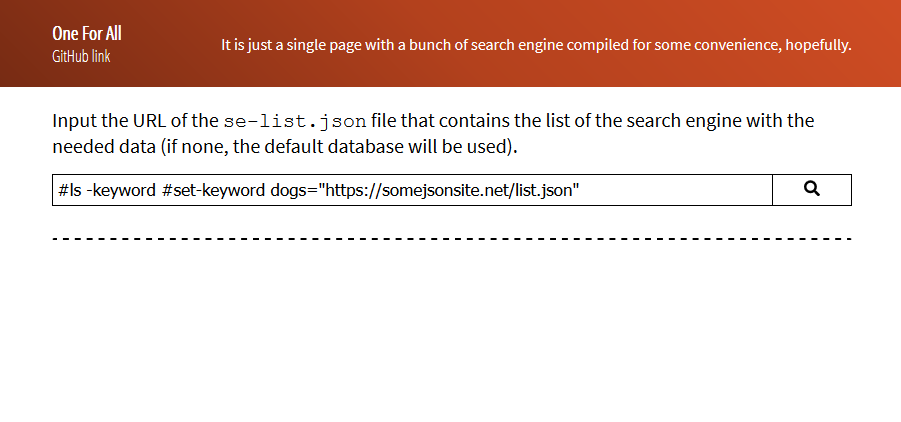

# Available commands
You can enter commands in the main input of the page as if you're using a CLI program.



Take note that valid commands must have `--$` before the main command keyword with their needed values to be separated by whitespaces.

Also, each of the command can only be executed once with the values of the first detected valid command.

One last thing, you can also use the arrow down and up key to jump between the command history. Take note that the history can only record the entries that you've entered on that session only.

## `set-keywords`
It sets a keyword to be associated to the specified URL. Think of them as setting an alias for the URL.

Aliases:
- `set-keyword`
- `set-kw`
- `set-kws`

Their values need to be a keyword and the URL to be associated with delimited by an equal sign. 

The keyword must have only at least one alphanumeric character. You can also include underscores and hypens for the keyword name. 

The URL also needs to be enclosed within quotation marks.

```
--$set-keywords books="https://jsonsite.com/foo-dogsquared/list/se-list.test.json"
```

You can also set multiple keywords at once.

```
--$set-keywords books="https://jsonsite.com/foo-dogsquared/list/se-list.test.json" moocs="https://moocsite.com/sample-list.json"
```

Once the keyword has been set, you can simply type the keyword to retrieve the JSON file associated with that keyword.


If you want to replace the associated URL of a certain keyword, simply enter the command again with the same keyword:

```
--$set-keywords books="https://someotherjsonsite.com/testnumbertwo.json"
```

## `remove-keywords`
Simply removes the keyword in your setting. Disallowing you to retrieve a database with an alias, unless you've set it again.

Aliases:
- `remove-keyword`
- `rm-kws`
- `rm-kw`

The needed value is simply either an array of keywords delimited by commas enclosed in square brackets or a bunch of whitespace-separated words, your choice.

```
--$remove-keywords [books,moocs]
--$remove-keywords books moocs
```

When you remove a keyword, of course, you can't retrieve a JSON from the associated URL anymore. 

## `default`
Sets the default JSON database to be used. The default database (when unset) is simply the `se-list.json` that is included with the repo (hopefully). The default database is also the database to be used when you enter nothing.

The command only needs a valid URL that ends with the `.json` file extension.

```
--$default https://somejsonsite.org/notfake.json
```


You can also clear the setting with by providing `-clear` as the value, making the file `se-list.json` to be the default database again.

## `show-list-at-start`
It's a setting that automatically retrieves the default database the next moment you've visited the page. 

Aliases:
- `slas` (lazy mode activated)

It's a boolean, which mean it only needs one of the possible values: `true` or `false`.

When you've set it to true, the effect will only be in effect in your next visit. This goes in tandem with the `default` setting, bringing your user-defined default database at the start of the visit.


